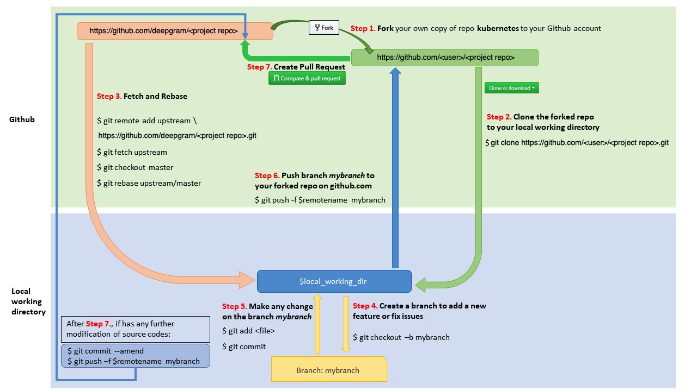

# GitHub Workflow



This is the standard GitHub workflow used by most projects on GitHub regardless of the [branching strategy](https://github.com/deepgram/deepgram-python-sdk/blob/main/.github/BRANCH_AND_RELEASE_PROCESS.md) you decided to employ.

However, it is important to understand [this project's branching process](https://github.com/deepgram/deepgram-python-sdk/blob/main/.github/BRANCH_AND_RELEASE_PROCESS.md) to know where you need to create your branches from.

- [GitHub Workflow](#github-workflow)
  - [1. Fork in the Cloud](#1-fork-in-the-cloud)
  - [2. Clone Fork to Local Storage](#2-clone-fork-to-local-storage)
  - [3. (Optional But HIGHLY Recommended) Set `git pull` to `rebase` Instead](#3-optional-but-highly-recommended-set-git-pull-to-rebase-instead)
  - [4. Create a Working Branch](#4-create-a-working-branch)
  - [5. Commit Your Changes](#5-commit-your-changes)
  - [6. Push to GitHub](#6-push-to-github)
  - [7. (If Needed) Keep Your Branch in Sync](#7-if-needed-keep-your-branch-in-sync)
  - [8. Create a Pull Request](#8-create-a-pull-request)
  - [9. Get a Code Review](#9-get-a-code-review)
  - [10. Squash Commits](#10-squash-commits)
  - [11. Merging a commit](#11-merging-a-commit)
  - [(If Needed) Reverting a Commit](#if-needed-reverting-a-commit)

## 1. Fork in the Cloud

1. Visit the repo in which you would like to contribute to
2. Click `Fork` button (top right) to establish a cloud-based fork.

## 2. Clone Fork to Local Storage

Set `user` to match your github profile name:

```bash
export user=<your github profile name>
```

Both `$working_dir` and `$user` are mentioned in the figure above.

Create your clone:

```bash
mkdir -p $working_dir
cd $working_dir
git clone git@github.com:$user/deepgram-python-sdk.git

cd $working_dir/deepgram-python-sdk
git remote add upstream git@github.com:deepgram/deepgram-python-sdk.git

# Never push to upstream main (or master)
git remote set-url --push upstream no_push

# Confirm that your remotes make sense:
git remote -v
```

## 3. (Optional But HIGHLY Recommended) Set `git pull` to `rebase` Instead

This is an optional step and we will do our best here to provide directions should you not set this, but doing a `git pull` is invasive and can get quite nasty. The preferred way is to **ALWAYS** use **rebase** in favor of a traditional `git pull`. 

This will override `git pull` to effectively alias or under the covers do a `git rebase` globally:

```bash
git config --global pull.rebase true
```

If you only want to do this per repo, you can navigate to the root of the repo and run this:

```bash
git config pull.rebase true
```

## 4. Create a Working Branch

Get your local `main` up to date. Note that depending on which repository you are working from, the default branch may be called `master` instead of `main`.

```bash
cd $working_dir/deepgram-python-sdk
git fetch upstream
git checkout main
git rebase upstream main
```

Create your new branch.

```bash
git checkout -b myfeature
```

You may now edit files on the `myfeature` branch.

## 5. Commit Your Changes

You will probably want to regularly commit your changes. It is likely that you will go back and edit, build, and test multiple times. After a few cycles of this, you might [amend your previous commit](https://www.w3schools.com/git/git_amend.asp).

```bash
git commit
```

## 6. Push to GitHub

When your changes are ready for review, push your working branch to your fork on GitHub.

```bash
git push --set-upstream origin myfeature
```

## 7. (If Needed) Keep Your Branch in Sync

You will need to periodically fetch changes from the `upstream` repository to keep your working branch in sync.

Make sure your local repository is on your working branch and run the following commands to keep it in sync:

```bash
git fetch upstream
git rebase upstream/main
```

> Please don't use `git pull` instead of the above `fetch` and `rebase`. Since `git pull` executes a merge, it creates merge commits. These make the commit history messy and violate the principle that commits ought to be individually understandable and useful.

If you do have conflicts after the `git rebase`, you can get the list of files with conflicts by using `git status`. The items in red are the items needing conflict resolution. Once you do resolve them, you can individually add them back into the rebase.

```bash
# what items need resolving
git status

# resolve the items by making code changes

# for each file that has been resolved
git add <relative path of the resolved file (ie deepgram/myfile.py)>

# continue the rebase
git rebase --continue

# update your branch on your fork
git push -f
```

Depending on how many commits are ahead of yours, you may need to repeat this step 6 multiple times.

Once the rebase is successful, you probably want to clean up the [commit message](https://www.w3schools.com/git/git_amend.asp).

```bash
git commit --amend
```

After doing this, move onto the next step.

## 8. Create a Pull Request

1. Visit your fork at `https://github.com/<user>/deepgram-python-sdk`
2. Click the **Compare & Pull Request** button next to your `myfeature` branch.
3. Submit your Pull Request

_If you have upstream write access_, please refrain from using the GitHub UI for creating PRs, because GitHub will create the PR branch inside the main repository rather than inside your fork.

### 9. Get a Code Review

Once your pull request has been opened it will be assigned to one or more reviewers. Those reviewers will do a thorough code review, looking for
correctness, bugs, opportunities for improvement, documentation and comments, and style.

Commit changes made in response to review comments to the same branch on your fork.

Very small PRs are easy to review. Very large PRs are very difficult to review.

### 10. Squash Commits

After a review, prepare your PR for merging by squashing your commits.

All commits left on your branch after a review should represent meaningful milestones or units of work. Use commits to add clarity to the development and review process.

Before merging a PR, squash the following kinds of commits:

- Fixes/review feedback
- Typos
- Merges and rebases
- Work in progress

Aim to have every commit in a PR compile and pass tests independently if you can, but it's not a requirement.

To squash your commits, perform an [interactive rebase](https://git-scm.com/book/en/v2/Git-Tools-Rewriting-History):

1. Check your git branch:

  ```bash
  git status
  ```

  The output should be similar to this:

  ```bash
  On branch your-contribution
  Your branch is up to date with 'origin/your-contribution'.
  ```

1. Start an interactive rebase using a specific commit hash, or count backwards from your last commit using `HEAD~<n>`, where `<n>` represents the number of commits to include in the rebase.

  To get this `<n>` value, the easiest way to do this is to run `git log` and then count the number of commits until you hit `main` but not including `main`.

  ```bash
  git log
  ```

  Once you have that number, continue with the rebase and squash.

  ```bash
  git rebase -i HEAD~3
  ```

  The output should be similar to this:

  ```bash
  pick 2ebe926 Original commit
  pick 31f33e9 Address feedback
  pick b0315fe Second unit of work

  # Rebase 7c34fc9..b0315ff onto 7c34fc9 (3 commands)
  #
  # Commands:
  # p, pick <commit> = use commit
  # r, reword <commit> = use commit, but edit the commit message
  # e, edit <commit> = use commit, but stop for amending
  # s, squash <commit> = use commit, but meld into previous commit
  # f, fixup <commit> = like "squash", but discard this commit's log message
  ...
  ```

1. Use a command line text editor to change the word `pick` to `squash` for the commits you want to squash, then save your changes and continue the rebase:

  ```bash
  pick 2ebe926 Original commit
  squash 31f33e9 Address feedback
  squash b0315fe Second unit of work
  ...
  ```

  The output after saving changes should look similar to this:

  ```bash
  [detached HEAD 61fdded] Second unit of work
   Date: Thu Mar 5 19:01:32 2020 +0100
   2 files changed, 15 insertions(+), 1 deletion(-)
   ...

  Successfully rebased and updated refs/heads/main.
  ```

1. Force push your changes to your remote branch:

  ```bash
  git push --force
  ```

## 11. Merging a commit

Once you've received review and approval, your commits are squashed, and your PR is ready for merging.

Merging happens automatically after both a Reviewer and Approver have approved the PR. If you haven't squashed your commits, they may ask you to do so before approving a PR.

## (If Needed) Reverting a Commit

In case you wish to revert a commit, use the following instructions.

_If you have upstream write access_, please refrain from using the `Revert` button in the GitHub UI for creating the PR, because GitHub will create the PR branch inside the main repository rather than inside your fork.

- Create a branch and sync it with upstream.

  ```bash
  # create a branch
  git checkout -b myrevert

  # sync the branch with upstream
  git fetch upstream
  git rebase upstream/main
  ```

- If the commit you wish to revert is a _merge commit_, use this command:

  ```bash
  # SHA is the hash of the merge commit you wish to revert
  git revert -m 1 <SHA>
  ```

  If it is a _single commit_, use this command:

  ```bash
  # SHA is the hash of the single commit you wish to revert
  git revert <SHA>
  ```

- This will create a new commit reverting the changes. Push this new commit to your remote.

  ```bash
  git push <your_remote_name> myrevert
  ```

- Finally, [create a Pull Request](#8-create-a-pull-request) using this branch.

> Attribution: This was in part borrowed from this [document](https://github.com/kubernetes/community/blob/master/contributors/guide/github-workflow.md) but tailored for our use case.
