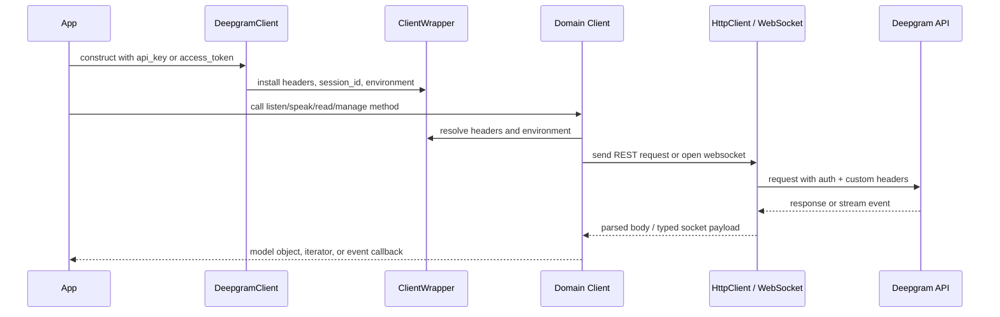

The SDK is mostly generated from Deepgram's API definition, but the entry layer and transport hooks are hand-written. That split is important because it explains why the public surface feels consistent while still supporting custom authentication and WebSocket transport overrides.

```mermaid
graph TD
  A[DeepgramClient / AsyncDeepgramClient<br/>src/deepgram/client.py] --> B[BaseClient / AsyncBaseClient<br/>src/deepgram/base_client.py]
  B --> C[SyncClientWrapper / AsyncClientWrapper<br/>src/deepgram/core/client_wrapper.py]
  C --> D[HttpClient / AsyncHttpClient<br/>src/deepgram/core/http_client.py]
  B --> E[listen]
  B --> F[speak]
  B --> G[read]
  B --> H[manage]
  B --> I[auth]
  B --> J[agent]
  B --> K[voice_agent]
  B --> L[self_hosted]
  E --> M[REST media client]
  E --> N[Listen socket clients]
  F --> O[Audio REST client]
  F --> P[Speak socket clients]
  J --> Q[Agent socket clients]
  A --> R[transport.install_transport()]
  R --> N
  R --> P
  R --> Q
```

## Key Design Decisions

### 1. A hand-written root client wraps generated code

`src/deepgram/client.py` subclasses the generated `BaseClient` and `AsyncBaseClient` from `src/deepgram/base_client.py`. That extra layer exists so the SDK can accept `access_token`, `session_id`, and `transport_factory`, even though the generated base client only knows about `api_key`, headers, timeouts, and the underlying `httpx` client.

This design keeps the generated domain clients stable while letting Deepgram patch real-world integration issues in a small, readable entry point. It also means auth precedence is handled once, near client construction, instead of in every domain method.

### 2. Domain clients are loaded lazily

The generated `BaseClient` stores `_listen`, `_speak`, `_read`, `_manage`, `_auth`, `_agent`, `_voice_agent`, and `_self_hosted` as optional attributes. Each property creates the corresponding client only on first access. That keeps the root client light, avoids import churn at startup, and mirrors the shape of the API surface without forcing every project to import every submodule.

### 3. REST and WebSocket flows share one wrapper

`src/deepgram/core/client_wrapper.py` centralizes environment selection, default headers, timeout lookup, and logging configuration. REST methods call into `HttpClient` or `AsyncHttpClient`, while WebSocket clients call `client_wrapper.get_headers()` and `client_wrapper.get_environment()`. That shared wrapper is why a `session_id` header or authorization override applies consistently to both HTTP requests and realtime connections.

### 4. Retry behavior is centralized in the HTTP layer

`src/deepgram/core/http_client.py` handles retry timing from `Retry-After`, `retry-after-ms`, and `x-ratelimit-reset`, then falls back to exponential backoff with jitter. The generated service clients stay focused on endpoint parameters and response parsing; they do not duplicate retry logic. This is the right split because retry policy is infrastructure, not domain behavior.

### 5. Custom transport support patches generated WebSocket clients globally

`src/deepgram/transport.py` monkey-patches the generated Listen, Speak, and Agent WebSocket modules listed in `_TARGET_MODULES`. That is a pragmatic choice: the generated clients already call `websockets.connect`, so the SDK intercepts those module-level references instead of forking all generated socket code. The trade-off is that transport overrides are process-global, which the docs call out explicitly in the client lifecycle concept page.

## Request And Data Lifecycle



For REST calls, a generated client such as `src/deepgram/listen/v1/media/client.py` converts parameters into request bodies or query strings, then returns parsed Pydantic models. For streaming calls, modules such as `src/deepgram/listen/v2/client.py` build a WebSocket URL, merge `RequestOptions`, and return a socket client whose `start_listening()` loop emits `EventType.OPEN`, `EventType.MESSAGE`, `EventType.ERROR`, and `EventType.CLOSE` from `src/deepgram/core/events.py`.

Incoming WebSocket payloads are parsed in the socket client modules using `construct_type(...)` from the internal unchecked model helper. Unknown message variants are skipped with a warning instead of crashing the stream. That makes the SDK more resilient to protocol evolution, especially for realtime endpoints where the server can add new event shapes over time.

## How The Pieces Fit Together

- Use the root client when you want stable authentication, shared headers, and one place to configure timeouts.
- Use generated domain clients when you need endpoint coverage; their methods match Deepgram API resources closely.
- Use socket clients when the endpoint requires bidirectional, realtime traffic; they layer event emission on top of the raw websocket.
- Use `RequestOptions` when a single request needs custom headers, query parameters, retries, or chunk sizing without changing global client configuration.

The net result is a hybrid SDK: generated enough to keep endpoint coverage broad, but with hand-written seams where Python developers usually need control.
