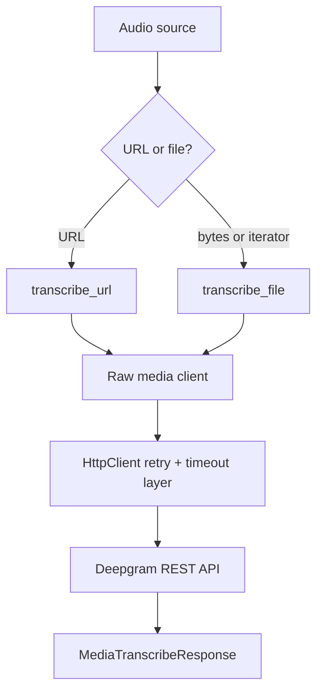

Batch transcription in this SDK lives under `client.listen.v1.media`. It is the simplest path when you have a complete file or a hosted recording and want a single response model instead of a live event stream.

## What It Is

`MediaClient` in `src/deepgram/listen/v1/media/client.py` exposes two primary methods:

- `transcribe_url(...)` for media hosted at an accessible URL,
- `transcribe_file(...)` for raw bytes or iterators of bytes.

Both methods solve the same problem: send prerecorded audio or video to Deepgram's speech-to-text REST API and get back a `MediaTranscribeResponse`. They also accept a large set of analysis options including summaries, topics, intents, speaker diarization, punctuation, and request tagging.

This concept connects directly to `RequestOptions`, Deepgram models such as `nova-3`, and downstream consumers like `read.v1.text.analyze` if you want to run text analysis after transcription.

## How It Works Internally

The generated `MediaClient` converts your keyword arguments into a request body or query string, then delegates to a raw client that performs the HTTP request. The important implementation detail is that `transcribe_file(...)` accepts `bytes`, `Iterator[bytes]`, or `AsyncIterator[bytes]`, so you can stream large local files without loading them fully into memory.

Internally, the shared HTTP stack from `src/deepgram/core/http_client.py` handles timeout resolution, request-body shaping, and retry behavior. If you pass a callback URL, the API may return a request identifier rather than final transcript text, so your application logic should branch on that response mode instead of assuming the transcript is already present.



## Basic Usage

```python
from deepgram import DeepgramClient

client = DeepgramClient()

response = client.listen.v1.media.transcribe_url(
    url="https://dpgr.am/spacewalk.wav",
    model="nova-3",
    smart_format=True,
    punctuate=True,
)

print(response.results.channels[0].alternatives[0].transcript)
```

## Advanced Usage

```python
from deepgram import DeepgramClient

client = DeepgramClient()

def read_file_in_chunks(path: str, chunk_size: int = 8192):
    with open(path, "rb") as handle:
        while True:
            chunk = handle.read(chunk_size)
            if not chunk:
                break
            yield chunk

response = client.listen.v1.media.transcribe_file(
    request=read_file_in_chunks("support-call.wav"),
    model="nova-3",
    diarize=True,
    paragraphs=True,
    utterances=True,
    detect_entities=True,
    summarize="v2",
    tag=["support", "priority-high"],
    request_options={
        "timeout_in_seconds": 120,
        "additional_query_parameters": {"detect_language": ["en", "es"]},
    },
)
```

<Callout type="warn">`transcribe_file(...)` supports generators specifically so you do not have to `read()` large media files into memory first. If you already know a request will complete asynchronously via `callback`, do not write client code that assumes `response.results.channels` is always present.</Callout>

## Choosing URL vs File Input

`transcribe_url(...)` is ideal when the media already lives in cloud storage or a public asset bucket. It minimizes upload time on your side and keeps the application code small. `transcribe_file(...)` is better when the recording lives on local disk, comes from another service in memory, or must not be re-hosted to an external URL.

## Trade-Offs

<Accordions>
<Accordion title="Hosted URLs vs direct file upload">
Hosted URLs reduce the amount of data your application has to move because the SDK sends a small JSON request instead of streaming the whole asset through your process. That usually means simpler code and better behavior in serverless environments where upload time matters. Direct file upload is still the better choice when the media is private, generated locally, or too sensitive to copy into a separate storage layer just to call the API. In practice, use URLs for durable shared assets and file upload for just-in-time or local recordings.
</Accordion>
<Accordion title="Full response now vs callback later">
Returning the transcript inline is easier because the application can continue in one request-response flow. Callback mode is better for large files, offline pipelines, or workloads where you do not want a worker blocked waiting for the response body. The cost is complexity: you need an endpoint that can receive the callback and reconcile it to the original job, and your code must treat the initial API response as job submission rather than final transcript data. That trade-off is worth it when throughput matters more than single-call simplicity.
</Accordion>
</Accordions>
