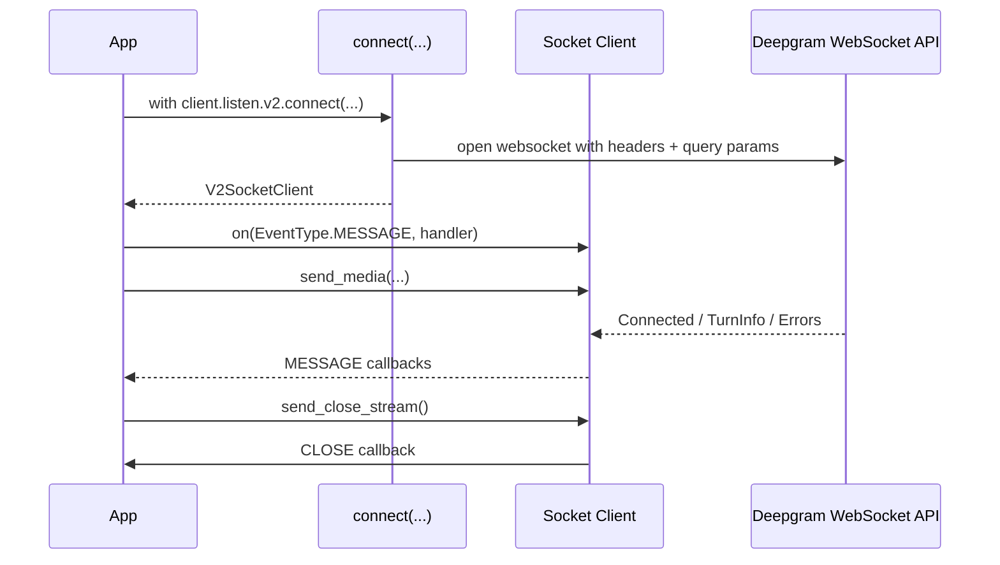

Realtime work in this SDK is built around socket clients returned by `connect(...)` methods. These sockets are still generated from the API definition, but the developer experience is shaped by `EventEmitterMixin` and typed send helpers.

## What It Is

The main streaming entry points are:

- `client.listen.v1.connect(...)` in `src/deepgram/listen/v1/client.py`,
- `client.listen.v2.connect(...)` in `src/deepgram/listen/v2/client.py`,
- `client.speak.v1.connect(...)` in `src/deepgram/speak/v1/client.py`.

Each returns a context-managed socket client that exposes `start_listening()`, `recv()`, iteration, and endpoint-specific send helpers such as `send_media()`, `send_text()`, `send_flush()`, or `send_close_stream()`.

These socket clients relate directly to `EventType` in `src/deepgram/core/events.py` and to the optional transport override layer in `src/deepgram/transport.py`.

## How It Works Internally

The `connect(...)` methods build a WebSocket URL from the active environment, encode query parameters, merge authorization and `RequestOptions`, and then call `websockets.connect`. Once connected, the socket client loops over incoming frames, parses JSON messages into typed models with `construct_type(...)`, and emits lifecycle events through `EventEmitterMixin`.

Listen v2 is optimized for conversational turn detection and exposes events such as `ListenV2TurnInfo`. Speak v1 returns a mixed stream of binary audio chunks and metadata events. Unknown JSON messages are skipped with a warning instead of tearing down the entire connection, which is why long-lived streams can survive protocol additions.



## Basic Usage

```python
from deepgram import DeepgramClient
from deepgram.core.events import EventType

client = DeepgramClient()

with client.listen.v2.connect(
    model="flux-general-en",
    encoding="linear16",
    sample_rate=16000,
) as connection:
    connection.on(EventType.MESSAGE, lambda message: print(getattr(message, "type", type(message).__name__)))
    connection.start_listening()
```

## Advanced Usage

```python
from deepgram import DeepgramClient
from deepgram.core.events import EventType
from deepgram.speak.v1.types import SpeakV1Text

client = DeepgramClient()

with client.speak.v1.connect(model="aura-2-asteria-en" encoding="linear16", sample_rate=24000) as connection:
    audio_chunks = []

    def on_message(message):
        if isinstance(message, bytes):
            audio_chunks.append(message)

    connection.on(EventType.MESSAGE, on_message)
    connection.send_text(SpeakV1Text(text="Hello from the streaming TTS API."))
    connection.send_flush()
    connection.send_close()
    connection.start_listening()
```

<Callout type="warn">Register handlers before calling `start_listening()`. The listening loop emits `OPEN`, then streams messages immediately, and it blocks the current thread until the websocket closes.</Callout>

## Listen v1 vs Listen v2

Use Listen v1 when you want the older speech-to-text websocket with a wider set of query parameters that mirror batch transcription. Use Listen v2 when your application is conversational and you care about turn segmentation, end-of-turn thresholds, or the `flux-general-en` style realtime model behavior shown in the examples.

## Trade-Offs

<Accordions>
<Accordion title="Event-driven callbacks vs manual recv()">
Callback-driven code is the better default because `start_listening()` already emits `OPEN`, `MESSAGE`, `ERROR`, and `CLOSE` in a consistent order. That keeps business logic close to the event type and makes it easy to pipe transcripts or audio into another service. Manual `recv()` is still useful in controlled loops, tests, or when you want pull-based backpressure rather than a push callback style. The trade-off is complexity: callback code is easier to start, while explicit `recv()` logic is easier to reason about in finite-state workflows.
</Accordion>
<Accordion title="Default websockets transport vs custom transport_factory">
The built-in transport is the simplest option and keeps you aligned with the generated code paths the SDK expects. `transport_factory` is valuable when your environment needs a proxy-aware transport, a mocked websocket in tests, or an alternate runtime integration, but `src/deepgram/transport.py` applies that patch globally to the process. That means it is powerful and low-friction, but not scoped to a single client instance in the way an `httpx_client` override is. Use it deliberately, especially in applications that create many clients with different transport assumptions.
</Accordion>
</Accordions>
