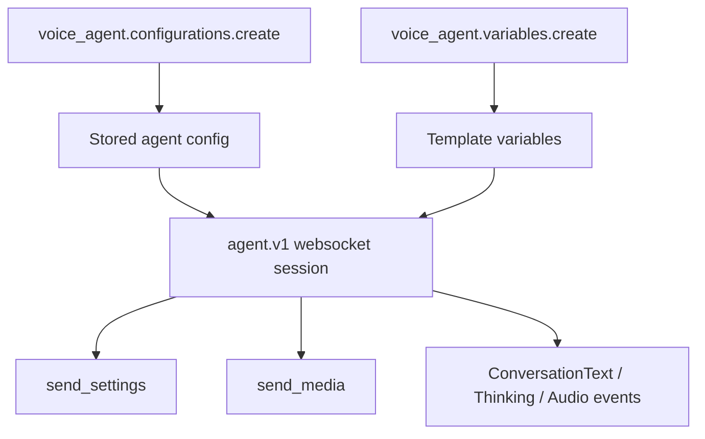

Deepgram exposes two related but distinct agent surfaces in this SDK. The realtime path lives under `client.agent.v1`, while the reusable configuration and variable APIs live under `client.voice_agent`.

## What It Is

The realtime `agent.v1` websocket builds an active conversational session. You send settings, stream user audio, receive transcripts and agent responses, and can update prompt, think, or speak settings during the session. The REST-style `voice_agent` clients manage reusable configuration assets so you do not have to send the full agent configuration inline every time.

This split exists because a live conversation and a reusable agent definition solve different problems. The websocket is session state. The `voice_agent.configurations` and `voice_agent.variables` modules are deployment-time configuration APIs.

## How It Works Internally

`src/deepgram/agent/v1/client.py` opens a websocket against the environment's `agent` URL and returns `V1SocketClient`. That socket exposes methods such as `send_settings`, `send_update_prompt`, `send_update_think`, `send_update_speak`, `send_media`, and `send_function_call_response`.

Inside `src/deepgram/agent/v1/socket_client.py`, outbound models are serialized with `_sanitize_numeric_types(...)` before sending. That helper exists because some integer-like fields in generated models are typed as floats, and the API rejects JSON such as `44100.0` for integer fields like `sample_rate`. On the REST side, `src/deepgram/voice_agent/configurations/client.py` and `src/deepgram/voice_agent/variables/client.py` manage stored agent definitions and template variables by project.



## Basic Usage

```python
from deepgram import DeepgramClient
from deepgram.agent.v1.types import (
    AgentV1Settings,
    AgentV1SettingsAgent,
    AgentV1SettingsAgentListen,
    AgentV1SettingsAgentListenProvider_V1,
    AgentV1SettingsAudio,
    AgentV1SettingsAudioInput,
)
from deepgram.types.speak_settings_v1 import SpeakSettingsV1
from deepgram.types.speak_settings_v1provider import SpeakSettingsV1Provider_Deepgram
from deepgram.types.think_settings_v1 import ThinkSettingsV1
from deepgram.types.think_settings_v1provider import ThinkSettingsV1Provider_OpenAi

client = DeepgramClient()

settings = AgentV1Settings(
    audio=AgentV1SettingsAudio(
        input=AgentV1SettingsAudioInput(encoding="linear16", sample_rate=24000)
    ),
    agent=AgentV1SettingsAgent(
        listen=AgentV1SettingsAgentListen(
            provider=AgentV1SettingsAgentListenProvider_V1(type="deepgram" model="nova-3")
        ),
        think=ThinkSettingsV1(
            provider=ThinkSettingsV1Provider_OpenAi(type="open_ai" model="gpt-4o-mini"),
            prompt="Keep answers brief.",
        ),
        speak=SpeakSettingsV1(
            provider=SpeakSettingsV1Provider_Deepgram(type="deepgram" model="aura-2-asteria-en")
        ),
    ),
)
```

## Advanced Usage

```python
from deepgram import DeepgramClient

client = DeepgramClient()
project_id = "PROJECT_ID"

config = client.voice_agent.configurations.create(
    project_id=project_id,
    config='{"listen":{"provider":{"type":"deepgram","model":"nova-3"}}}',
    metadata={"team": "support", "tier": "prod"},
)

client.voice_agent.variables.create(
    project_id=project_id,
    key="DG_BRAND_NAME",
    value="Acme Health",
)

think_models = client.agent.v1.settings.think.models.list()
print(think_models.models[0])
```

<Callout type="warn">Deleting a voice-agent configuration is not just housekeeping. The generated `ConfigurationsClient.delete(...)` docstring explicitly warns that removing a configuration UUID that production traffic still references can cause an outage.</Callout>

## How The Two Surfaces Relate

- `agent.v1` is for active sessions.
- `voice_agent.configurations` is for reusable agent definitions.
- `voice_agent.variables` is for template substitution data.
- `agent.v1.settings.think.models.list()` is a discovery endpoint that helps you choose supported think models before composing settings.

## Trade-Offs

<Accordions>
<Accordion title="Inline settings vs reusable stored configuration">
Inline settings are ideal during prototyping because everything needed to start the session lives in the same Python process and the same source file. That makes debugging fast and keeps configuration changes close to the code sending audio into the session. Stored configurations are better for teams that need reviewable assets, shared configuration UUIDs, or environment-specific promotion workflows. The trade-off is governance versus agility: inline settings move faster, while stored configs reduce duplication and make rollouts more deliberate.
</Accordion>
<Accordion title="Realtime agent sessions vs voice_agent REST management">
The websocket is the live execution surface, so use it when the conversation is happening now and timing matters. The REST management APIs are not a replacement for that session; they are control-plane endpoints used to create, read, update metadata, and delete reusable assets by project. Treating them as separate layers produces cleaner systems: build configurations ahead of time, then reference them from the realtime path. Trying to do both jobs in one layer usually creates brittle startup logic and makes rollbacks harder.
</Accordion>
</Accordions>
